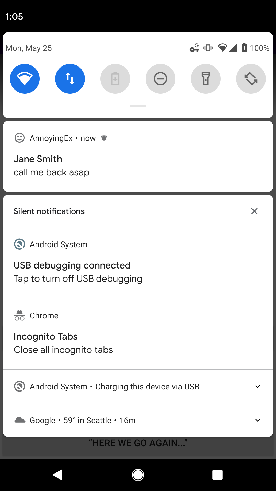
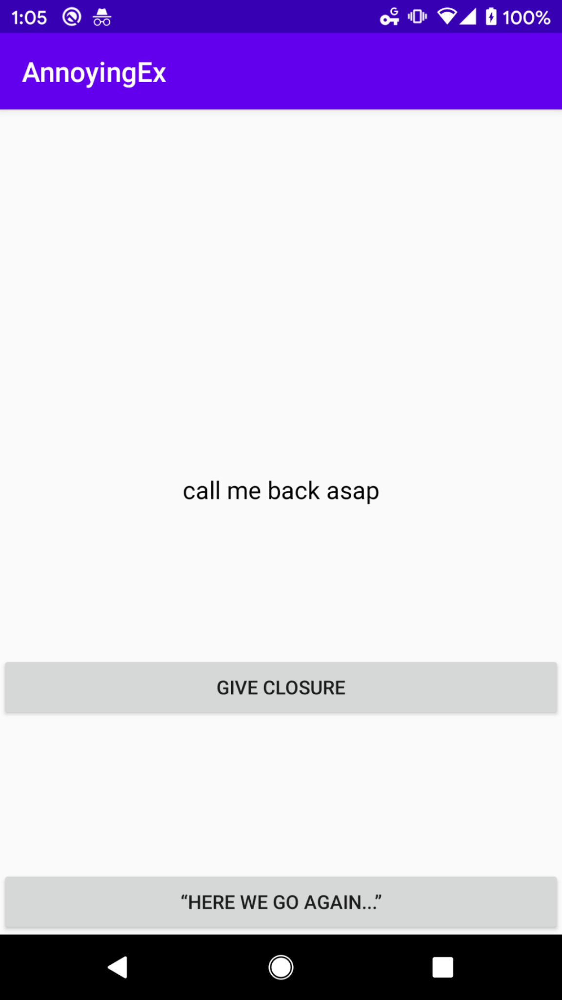

# Liam Albright Homework 5 **AnnoyingEx**
Description: Android app that fetches a list of strings from a HTTP endpoint. Then uses those strings to create a notification system that displays those strings and runs in the background of the phone. 

Extra credit:
1. lanuched main activity from notification with notification text display newly on Main Actiivty screen

## **App screenshot1**

## **App screenshot2**

